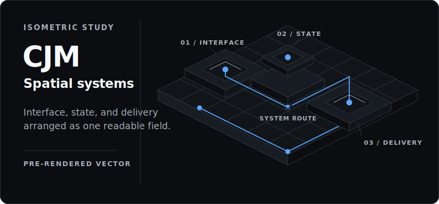

<picture>
  <source media="(max-width: 480px)" srcset="./assets/heroes/hero-command-mobile.svg" />
  <source media="(max-width: 960px)" srcset="./assets/heroes/hero-command-compact.svg" />
  
</picture>

**Choi Jung Mua (CJM)** — frontend engineer building durable interfaces for real products.

I focus on responsive product UI, maintainable structure, and practical delivery automation.

## Selected work

- **ClickPick** — A map-based community for discovering and sharing places, with posts, profiles, and admin tools. [ClickPick source](https://github.com/ClickPickProject/FrontEnd) · [ClickPick live site](https://clickpick.vercel.app)
- **ALLIM** — A TypeScript frontend application. [ALLIM source](https://github.com/choijungmua/allim-front)
- **Contribution Art** — Automated contribution-graph art driven by Git history. [Contribution Art source](https://github.com/choijungmua/contribution-art)

Hero Lab — choose a direction

Three profile studies use finite self-hosted SVG motion, while Spatial 3D is a pre-rendered vector study; this GitHub-native disclosure is the interaction.

**Editorial.** Large type, disciplined rules, and generous space set out a clear interface thesis.

**Terminal Session.** A finite session reveals the build, verify, and ship sequence, then settles.

**Product Proof.** Named work takes the lead through three restrained project regions.

**Systems Instrument.** An illustrative signal path maps structure through verification to release.

**Spatial 3D.** An isometric vector field connects interface, state, and delivery without implying live controls.

## Principles

Clear state. Deliberate motion. Product intent. Build, verify, and ship with evidence.

## Contact

[GitHub profile](https://github.com/choijungmua) · [Email](mailto:chlwjd022@gmail.com)

---

Self-hosted profile artwork with no remote image or stats services.
