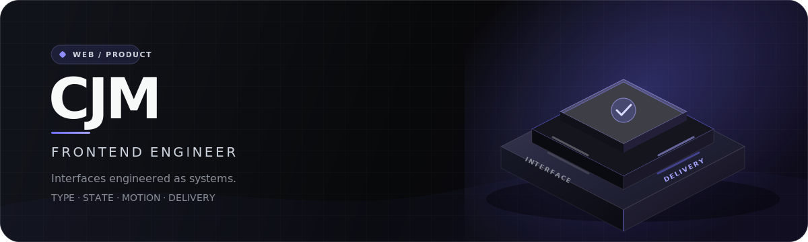
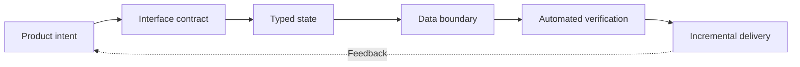

# CJM

**Frontend engineer building durable interfaces for real products.**

`TypeScript` · `React` · `Next.js` · `TanStack Query` · `Tailwind CSS`

[Selected work](#selected-work) · [GitHub](https://github.com/choijungmua) · [Email](mailto:chlwjd022@gmail.com)

## About

I build frontend applications with React and Next.js, with an emphasis on clear interaction, maintainable UI structure, and production-ready delivery.

My recent work spans product interfaces, map-based communities, automated Git workflows, and small experiments that turn an idea into something people can use.

## Selected work

| Project | What it does | Stack | Links |
| --- | --- | --- | --- |
| **ClickPick** | A map-based community for discovering and sharing places, with posts, profiles, and admin tools. | Next.js 14, React, Tailwind CSS | [Source](https://github.com/ClickPickProject/FrontEnd) · [Live](https://clickpick.vercel.app) |
| **ALLIM Front** | A TypeScript frontend application under active development. | TypeScript | [Source](https://github.com/choijungmua/allim-front) |
| **Contribution Art** | Automated contribution-graph art driven by Git history. | Shell, GitHub Actions | [Source](https://github.com/choijungmua/contribution-art) |

## Engineering focus

- Reusable frontend architecture and consistent UI primitives
- Responsive, interaction-focused product experiences
- Practical automation around delivery and repository workflows

## How I build

## Working stack

| Area | Tools |
| --- | --- |
| Product UI | TypeScript, JavaScript, React, Next.js |
| Styling | HTML, CSS, Sass, Tailwind CSS |
| State and data | TanStack Query, Recoil, Firebase |
| Delivery | Git, GitHub Actions, Vercel |

## Contact

For project conversations or collaboration, reach me at [chlwjd022@gmail.com](mailto:chlwjd022@gmail.com).
